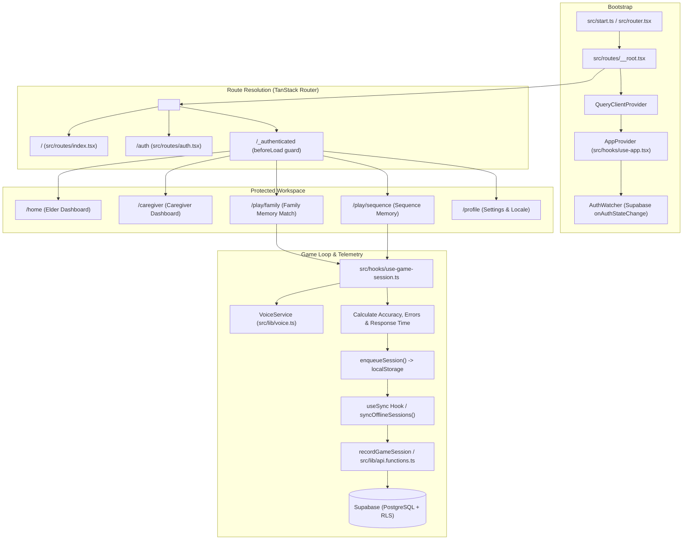
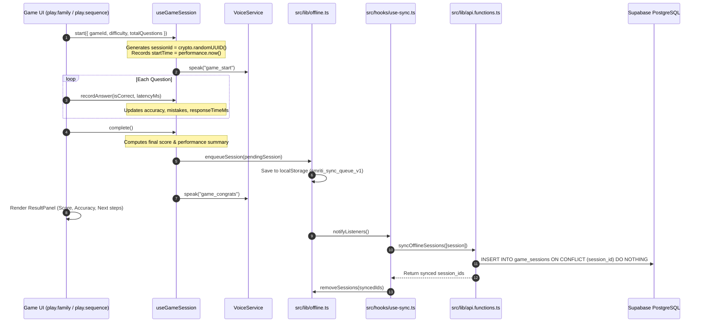

# Execution Flow & Codebase Architecture — Smriti Sathi (स्मृति साथी)

This document details how execution flows across the Smriti Sathi codebase: entry points, bootstrap sequence, route dispatching, authentication lifecycle, game loop mechanics, offline synchronization, and server functions.

---

## 1. High-Level Architecture Flowchart



---

## 2. Bootstrapping & Entry Sequence

1. **Client Startup (`src/start.ts`)**:
   - Initializes TanStack Start client runtime.
   - Instantiates the application router via `getRouter()` from [`src/router.tsx`](file:///i:/Projects/Smrithi-sathi/src/router.tsx).
2. **Router Configuration ([`src/router.tsx`](file:///i:/Projects/Smrithi-sathi/src/router.tsx))**:
   - Creates TanStack Router using the generated route tree [`src/routeTree.gen.ts`](file:///i:/Projects/Smrithi-sathi/src/routeTree.gen.ts).
   - Injects a shared `QueryClient` instance into the route context.
3. **Root Shell & Layout ([`src/routes/__root.tsx`](file:///i:/Projects/Smrithi-sathi/src/routes/__root.tsx))**:
   - `RootShell`: Renders HTML document scaffolding, meta tags, and loads Google Fonts (`Inter`, `Space Grotesk`) and CSS tokens [`src/styles.css`](file:///i:/Projects/Smrithi-sathi/src/styles.css).
   - `RootComponent`: Wraps application in `<QueryClientProvider>`, `<AppProvider>`, `<AuthWatcher>`, `<Outlet />`, and global toast container `<Toaster />`.
4. **Auth State Synchronization (`AuthWatcher`)**:
   - Subscribes to `supabase.auth.onAuthStateChange`.
   - On `SIGNED_IN`, `SIGNED_OUT`, or `USER_UPDATED`, triggers `router.invalidate()` and invalidates query caches to trigger fresh data loading.

---

## 3. Global Context Lifecycle (`src/hooks/use-app.tsx`)

`AppProvider` supplies global session, profile, i18n, and sound state:

```
AppProvider Mount
  │
  ├── 1. Get initial session: supabase.auth.getSession()
  ├── 2. Fetch User Profile: getMe() server function (or cache)
  ├── 3. Restore persisted preferences from localStorage:
  │      ├── smriti_lang (Default: "en", options: "hi", "mr", "as")
  │      └── smriti_sound_enabled (Default: true)
  ├── 4. Configure VoiceService:
  │      ├── VoiceService.setLanguage(lang)
  │      └── VoiceService.setEnabled(soundEnabled)
  └── 5. Auto-sync offline game queue via useSync()
```

---

## 4. Routing & Role Dispatching

- **Landing Page ([`src/routes/index.tsx`](file:///i:/Projects/Smrithi-sathi/src/routes/index.tsx))**:
  - Unauthenticated users view the landing hero, feature overview, and call-to-action buttons.
  - If a user is already signed in with an active profile, an effect redirects immediately:
    - If `profile.role === "caregiver"` $\rightarrow$ Navigates to `/caregiver`.
    - If `profile.role === "elder"` $\rightarrow$ Navigates to `/home`.
- **Authentication Guard ([`src/routes/_authenticated/route.tsx`](file:///i:/Projects/Smrithi-sathi/src/routes/_authenticated/route.tsx))**:
  - `beforeLoad` executes `supabase.auth.getUser()`.
  - If no session or an error occurs, it throws a redirect to `/auth`.
- **Elder Dashboard ([`src/routes/_authenticated/home.tsx`](file:///i:/Projects/Smrithi-sathi/src/routes/_authenticated/home.tsx))**:
  - Displays large, high-contrast action cards for:
    - **Family Memory Match** (`/play/family`)
    - **Sequence Memory** (`/play/sequence`)
  - Displays daily routine and medication reminders with one-tap completion acknowledgment.
- **Caregiver Command Hub ([`src/routes/_authenticated/caregiver.tsx`](file:///i:/Projects/Smrithi-sathi/src/routes/_authenticated/caregiver.tsx))**:
  - Fetches associated elders via `getMe()` and selected elder details via `getElderOverview()`.
  - Displays game activity trends using [`src/components/trend-chart.tsx`](file:///i:/Projects/Smrithi-sathi/src/components/trend-chart.tsx).
  - Photo management (uploading portraits with relationship tags for Family Memory Match).
  - Scheduling and managing medication / routine reminders.
  - Generating and linking 6-character Care Codes (`linkElderCaregiver`).

---

## 5. Game Loop & Session Telemetry

Both cognitive games follow an identical, standardized lifecycle managed by [`src/hooks/use-game-session.ts`](file:///i:/Projects/Smrithi-sathi/src/hooks/use-game-session.ts):



---

## 6. Deterministic Performance & Adaptive Difficulty Flow

File: [`src/lib/performance.ts`](file:///i:/Projects/Smrithi-sathi/src/lib/performance.ts)

1. **Difficulty Ladder**: `easy` $\rightarrow$ `medium` $\rightarrow$ `hard`
2. **Recommendation Algorithm (`recommendDifficulty`)**:
   - Queries last 5 sessions for the game.
   - If average accuracy $\ge 80\%$, mistakes $\le 1$, and response speed is adequate:
     $\rightarrow$ Promotes to next level (`step(current, +1)`).
   - If average accuracy $< 50\%$ or mistakes $\ge 3$:
     $\rightarrow$ Steps down to reinforce confidence (`step(current, -1)`).
   - Otherwise maintains level with a clear rationale string.
3. **Trend Calculation (`calculateTrend`)**:
   - Compares the average score and accuracy of the older half of recent sessions against the newer half.
   - Delta $> +5\%$ $\rightarrow$ `"improving"`
   - Delta $< -10\%$ $\rightarrow$ `"declining"`
   - Within $[-10\%, +5\%]$ $\rightarrow$ `"stable"`

---

## 7. Server Functions API Contract

Defined in [`src/lib/api.functions.ts`](file:///i:/Projects/Smrithi-sathi/src/lib/api.functions.ts) using `createServerFn`:

| Server Function | HTTP Method | Auth Required | Purpose |
|---|---|---|---|
| `getMe` | GET | Yes | Retrieves current user profile, linked elders, or linked caregiver |
| `updateMyProfile` | POST | Yes | Updates name, age, preferred language |
| `getElderOverview` | POST | Yes | Returns elder profile, recent sessions, photos, and reminders for caregiver |
| `recordGameSession` | POST | Yes | Records completed game session (idempotent upsert via `session_id`) |
| `syncOfflineSessions` | POST | Yes | Batch synchronizes offline sessions from client queue |
| `saveFamilyPhoto` | POST | Yes | Saves uploaded portrait URL, name, and relationship tag |
| `deleteFamilyPhoto` | POST | Yes | Deletes photo from profile and database |
| `createReminder` | POST | Yes | Schedules daily medication/routine reminder |
| `toggleReminderDone` | POST | Yes | Acknowledges reminder completion for today |
| `generateCareCode` | POST | Yes | Creates 6-character pairing code for elder |
| `linkElderCaregiver`| POST | Yes | Links caregiver and elder using care code |

---

## 8. Session Modification & File Tracking Log

Whenever files are modified or introduced during coding sessions, log them in this section:

| Date | Modified File | Purpose of Modification |
|---|---|---|
| 2026-09-10 | `DECISIONS.md` | Created architectural decision records catalog |
| 2026-09-10 | `FLOW.md` | Created comprehensive execution and lifecycle documentation |
| 2026-09-10 | `AGENTS.md` | Added mandatory agent protocols for decision logging, flow maintenance, and self-quizzing |
| 2026-09-11 | `src/routes/_authenticated/play.sequence.tsx` | Implemented multi-tier Easy/Medium/Hard progression with 2/4/6 tiles and gentle retries |
| 2026-09-11 | `src/lib/i18n.ts` | Added level, level_up, retry_prompt, highest_level_reached across EN, HI, MR, AS |
| 2026-09-11 | `src/components/result-panel.tsx` | Added optional levelLabel highlight stat card to celebrate peak tier reached |
| 2026-09-11 | `DECISIONS.md` | Added ADR-009 for progressive sequence memory grid |
| 2026-09-11 | `src/components/app-shell.tsx` | Updated signOut to navigate to root landing page (/) instead of direct /auth |
| 2026-09-11 | `src/routes/_authenticated/route.tsx` | Updated unauthenticated guard to redirect to root landing page (/) |
| 2026-09-11 | `src/lib/offline.ts` | Added `saveCachedFamily` and `getCachedFamily` for offline photo persistence |
| 2026-09-11 | `src/lib/api.functions.ts` | Added caregiver-elder bidirectional relationship fallback in `listFamily` |
| 2026-09-11 | `src/hooks/use-game-session.ts` | Added optional `userId` override in `GameOutcome` for linked elder attribution |
| 2026-09-11 | `src/lib/i18n.ts` | Added `need_family_more` and `caregiver_preview` translations across EN, HI, MR, AS |
| 2026-09-11 | `DECISIONS.md` | Added ADR-010 for Caregiver-Elder Family Photo Linking & Offline Sync |
| 2026-09-11 | `src/routes/_authenticated/play.family.tsx` | Implemented preview face/name intro + persistent photo anchor in question and feedback |
| 2026-09-11 | `src/lib/i18n.ts` | Added `choose_name` key across EN, HI, MR, AS |
| 2026-09-11 | `DECISIONS.md` | Added ADR-011 for Spaced Retrieval Family Memory Match (Cueing & Persistent Visual Anchor) |


