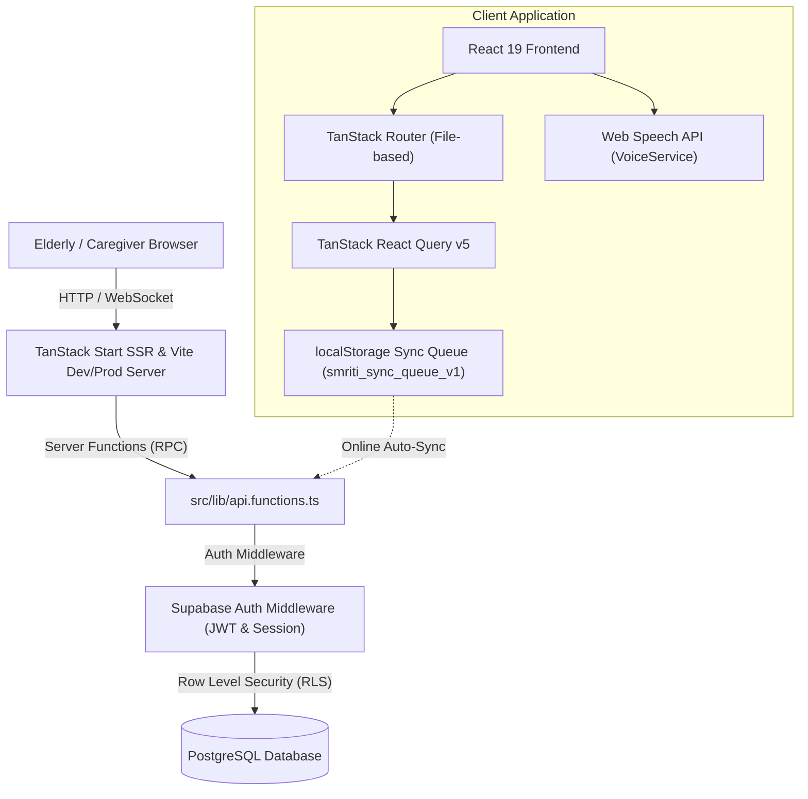

# Technical Implementation Guide

## Project: **Smriti Sathi (स्मृती साथी)**
**Architecture, Database Schema, API Contracts, and Deployment Specifications**

---

## 1. System Architecture Overview

Smriti Sathi is built using a modern full-stack TypeScript architecture on **TanStack Start**, **React 19**, and **Supabase**.



### Key Architectural Tenets
1. **Server Functions (`createServerFn`)**: Server-side endpoints invoked directly by typed frontend hooks without bespoke REST boilerplates.
2. **Context-Enforced Row Level Security (RLS)**: Server functions execute within the Supabase context of the calling user; database functions like `public.can_access(user_id)` restrict all data operations.
3. **Idempotent Client-Side Session Generation**: Game sessions originate with UUIDs generated on the client device (`crypto.randomUUID()`), ensuring offline submissions do not duplicate rows upon replay.

---

## 2. Directory & Module Structure

```
d:/SIH2K26/
├── public/                    # Static assets, fallback avatars, icons
├── src/
│   ├── components/            # Reusable UI & presentation widgets
│   │   ├── app-shell.tsx      # Main layout, navigation, language selector & sound toggles
│   │   ├── face-tile.tsx      # High-contrast portrait tile with initials/fallback
│   │   ├── photo-input.tsx    # Drag-and-drop / file upload for family photos
│   │   ├── result-panel.tsx   # End-of-game performance & celebratory modal
│   │   ├── trend-chart.tsx    # Recharts-powered performance trends
│   │   └── ui/                # Radix UI + Tailwind design system components
│   ├── hooks/                 # Custom React hooks
│   │   ├── use-app.tsx        # Global context (auth, current user profile, i18n helper)
│   │   └── use-game-session.ts# Game timer, metrics collector & offline sync pipeline
│   ├── integrations/          # External service integrations
│   │   └── supabase/          # Supabase client, auth middleware, session helpers
│   ├── lib/                   # Business logic, engines & utility libraries
│   │   ├── api.functions.ts   # TanStack Start server functions (CRUD & aggregations)
│   │   ├── error-capture.ts   # Client-side telemetry & error reporting
│   │   ├── i18n.ts            # Multilingual dictionaries (EN, HI, MR, AS)
│   │   ├── offline.ts         # LocalStorage queue & auto-sync event listeners
│   │   ├── performance.ts     # Deterministic difficulty & trend calculation rules
│   │   └── voice.ts           # SpeechSynthesis wrapper with regional voice resolution
│   ├── routes/                # File-based TanStack Router pages
│   │   ├── __root.tsx         # Root document shell with Meta tags & providers
│   │   ├── index.tsx          # Dual-persona landing page (Patient vs Caregiver)
│   │   ├── auth.tsx           # Authentication modal & sign-up forms
│   │   └── _authenticated/    # Protected route layout (requires valid session)
│   │       ├── home.tsx       # Elder home page: Game launchers & daily reminders
│   │       ├── caregiver.tsx  # Caregiver command center (charts, photos, reminders)
│   │       ├── play.family.tsx# Family Memory Match interactive game
│   │       ├── play.sequence.tsx # Sequence Memory interactive game
│   │       └── profile.tsx    # Account & language settings
│   ├── routeTree.gen.ts       # Generated route tree
│   ├── router.tsx             # Router instance configuration
│   ├── server.ts              # TanStack Start entry server
│   ├── start.ts               # SSR entry handler
│   └── styles.css             # Tailwind v4 theme, font variables & accessible styling
├── supabase/
│   ├── config.toml            # Local Supabase configuration
│   └── migrations/            # Versioned SQL migrations and RLS policies
├── package.json               # Dependencies and scripts
└── vite.config.ts             # Vite configuration with TanStack Start & Tailwind plugins
```

---

## 3. Database Schema & Row Level Security (RLS)

All database entities reside in the `public` schema in PostgreSQL with RLS enabled.

### 3.1 Profiles Table (`public.profiles`)
Represents registered users (both Elders and Caregivers).
```sql
CREATE TABLE public.profiles (
  id UUID PRIMARY KEY REFERENCES auth.users ON DELETE CASCADE,
  full_name TEXT NOT NULL DEFAULT '',
  role TEXT NOT NULL DEFAULT 'elderly' CHECK (role IN ('elderly','caregiver')),
  age INT,
  language TEXT NOT NULL DEFAULT 'en' CHECK (language IN ('en','hi','mr','as')),
  photo_url TEXT,
  care_code TEXT UNIQUE,
  caregiver_id UUID REFERENCES public.profiles(id) ON DELETE SET NULL,
  created_at TIMESTAMPTZ NOT NULL DEFAULT now(),
  updated_at TIMESTAMPTZ NOT NULL DEFAULT now()
);
```

### 3.2 Authorization Helper (`public.can_access`)
Enforces that a user can only view or mutate records if they own the record or are the linked caregiver.
```sql
CREATE OR REPLACE FUNCTION public.can_access(_target UUID)
RETURNS BOOLEAN LANGUAGE SQL STABLE SECURITY DEFINER SET search_path = public AS $$
  SELECT _target = auth.uid() OR EXISTS (
    SELECT 1 FROM public.profiles p WHERE p.id = _target AND p.caregiver_id = auth.uid()
  );
$$;
```

### 3.3 Family Members Table (`public.family_members`)
Stores photo references and relationships used in `family_memory_match`.
```sql
CREATE TABLE public.family_members (
  id UUID PRIMARY KEY DEFAULT gen_random_uuid(),
  user_id UUID NOT NULL REFERENCES public.profiles(id) ON DELETE CASCADE,
  name TEXT NOT NULL,
  relationship TEXT NOT NULL,
  photo_url TEXT,
  created_at TIMESTAMPTZ NOT NULL DEFAULT now()
);
```

### 3.4 Game Sessions Table (`public.game_sessions`)
Stores every completed game round with fine-grained telemetry.
```sql
CREATE TABLE public.game_sessions (
  session_id UUID PRIMARY KEY, -- Idempotent client UUID
  user_id UUID NOT NULL REFERENCES public.profiles(id) ON DELETE CASCADE,
  game_id TEXT NOT NULL,
  difficulty TEXT NOT NULL DEFAULT 'easy',
  score INT NOT NULL DEFAULT 0,
  accuracy NUMERIC(5,4) NOT NULL DEFAULT 0,
  mistakes INT NOT NULL DEFAULT 0,
  response_time_ms INT NOT NULL DEFAULT 0,
  total_questions INT NOT NULL DEFAULT 0,
  correct_answers INT NOT NULL DEFAULT 0,
  played_at TIMESTAMPTZ NOT NULL DEFAULT now(),
  created_at TIMESTAMPTZ NOT NULL DEFAULT now()
);
CREATE INDEX game_sessions_user_played_idx ON public.game_sessions (user_id, played_at DESC);
```

### 3.5 Reminders & Logs (`public.reminders`, `public.reminder_logs`)
Manages daily medication, hydration, and custom alerts.
```sql
CREATE TABLE public.reminders (
  id UUID PRIMARY KEY DEFAULT gen_random_uuid(),
  user_id UUID NOT NULL REFERENCES public.profiles(id) ON DELETE CASCADE,
  title TEXT NOT NULL,
  category TEXT NOT NULL DEFAULT 'custom',
  scheduled_time TIME NOT NULL DEFAULT '09:00',
  active BOOLEAN NOT NULL DEFAULT true,
  created_at TIMESTAMPTZ NOT NULL DEFAULT now()
);

CREATE TABLE public.reminder_logs (
  id UUID PRIMARY KEY DEFAULT gen_random_uuid(),
  reminder_id UUID NOT NULL REFERENCES public.reminders(id) ON DELETE CASCADE,
  user_id UUID NOT NULL REFERENCES public.profiles(id) ON DELETE CASCADE,
  log_date DATE NOT NULL DEFAULT current_date,
  status TEXT NOT NULL DEFAULT 'acknowledged' CHECK (status IN ('acknowledged','missed')),
  created_at TIMESTAMPTZ NOT NULL DEFAULT now(),
  UNIQUE (reminder_id, log_date)
);
```

---

## 4. Server Functions API Contract

Defined in `src/lib/api.functions.ts` via `@tanstack/react-start`. All functions require authenticated context via `requireSupabaseAuth`.

| Function | Method | Input Parameters | Return Type | Description |
| :--- | :--- | :--- | :--- | :--- |
| `getMe` | `GET` | *None* | `{ profile, people }` | Gets current profile & linked elderly patients (if caregiver). |
| `updateMyProfile`| `POST`| `{ full_name?, age?, language? }` | `Profile` | Updates profile name, age, or preferred language. |
| `linkElderly` | `POST`| `{ code: string }` | `{ user_id: string }` | Binds caregiver to elderly user using 6-char Care Code. |
| `listFamily` | `GET` | `{ user_id: string }` | `FamilyMember[]` | Returns family members for specified elderly user. |
| `saveFamilyMember`| `POST`| `{ id?, user_id, name, relationship, photo_url }` | `FamilyMember` | Creates or updates a family member card. |
| `deleteFamilyMember`| `POST`| `{ id: string }` | `{ ok: true }` | Removes family member from profile. |
| `recordGameResult`| `POST`| `SessionMeasurement` | `GameSession` | Upserts idempotent game session record and recalculates recommendation. |
| `listGameResults`| `GET` | `{ user_id: string, limit?: number }` | `GameSession[]` | Returns historical game logs for charting. |
| `getPerformanceTrend`| `GET` | `{ user_id: string, game_id?: string }` | `TrendResult` | Aggregates accuracy, score, response time & calculates trend. |
| `recommendNextDifficulty`| `GET`| `{ user_id: string, game_id: string }` | `DifficultyRecommendation` | Computes rule-based difficulty progression (`easy`/`med`/`hard`). |
| `listReminders` | `GET` | `{ user_id: string }` | `{ reminders, logs }` | Fetches active reminders and today's log statuses. |
| `acknowledgeReminder`| `POST`| `{ id: string, user_id: string }` | `ReminderLog` | Logs reminder acknowledgment for today's date. |
| `saveReminder` | `POST`| `{ id?, user_id, title, scheduled_time, category }` | `Reminder` | Inserts or updates a daily reminder. |
| `deleteReminder`| `POST`| `{ id: string }` | `{ ok: true }` | Removes reminder from database. |
| `seedDemoData` | `POST`| `{ user_id: string }` | `{ ok: true }` | Seeds starter family members and sample sessions for testing. |

---

## 5. Offline Sync Engine Specification

The offline synchronization engine (`src/lib/offline.ts` & `src/hooks/use-game-session.ts`) guarantees continuous operation regardless of connectivity:

1. **Session Completion**:
   ```typescript
   const session: PendingSession = {
     session_id: newSessionId(), // crypto.randomUUID()
     user_id,
     game_id,
     difficulty,
     score,
     accuracy,
     mistakes,
     response_time_ms,
     total_questions,
     correct_answers,
     played_at: new Date().toISOString()
   };
   saveSessionLocally(session);
   ```
2. **Local Caching**: The record is immediately pushed to `localStorage` key `smriti_sync_queue_v1` and published to UI subscribers.
3. **Synchronization Attempt**:
   - If `navigator.onLine === true`, `flushSyncQueue()` invokes `recordGameResult` on each queued item.
   - Upon successful response, the specific `session_id` is removed from `smriti_sync_queue_v1`.
   - If network failure occurs, the item remains in the queue and sync retries automatically upon `window.addEventListener("online")`.
   - The server enforces `PRIMARY KEY (session_id)` to prevent duplicate entries if retried.

---

## 6. Voice & Multilingual Architecture

- **Supported Locales**:
  - `en`: English (`en-IN`)
  - `hi`: Hindi (`hi-IN`)
  - `mr`: Marathi (`mr-IN`)
  - `as`: Assamese (`as-IN`)
- **Speech Synthesis Pipeline (`src/lib/voice.ts`)**:
  - `VoiceService.speak(key, customText?)`:
    1. Looks up translated text in `src/lib/i18n.ts`.
    2. Resolves preferred regional voice using `window.speechSynthesis.getVoices()`.
    3. Falls back gracefully to system default speech if specific regional pack is not installed on the OS.
    4. Sets pitch (`1.0`) and gentle rate (`0.85`–`0.9`) optimized for elderly auditory processing.

---

## 7. Setup, Environment, and Deployment

### 7.1 Prerequisites
- **Node.js**: $\ge 20.x$
- **Package Manager**: `npm` or `bun`
- **Supabase Instance**: Local CLI or Hosted Supabase project

### 7.2 Environment Configuration (`.env`)
```ini
VITE_SUPABASE_URL=https://your-project.supabase.co
VITE_SUPABASE_ANON_KEY=your-anon-key
```

### 7.3 Development Commands
```bash
# Install dependencies
npm install

# Run Vite dev server with TanStack Start
npm run dev

# Run ESLint validation
npm run lint

# Format codebase
npm run format

# Production build
npm run build
```

### 7.4 Deployment Targets
- Cloudflare Pages / Workers (via `@tanstack/react-start/server-functions`)
- Vercel / Netlify / Docker container running `vite preview` / Node runtime.

